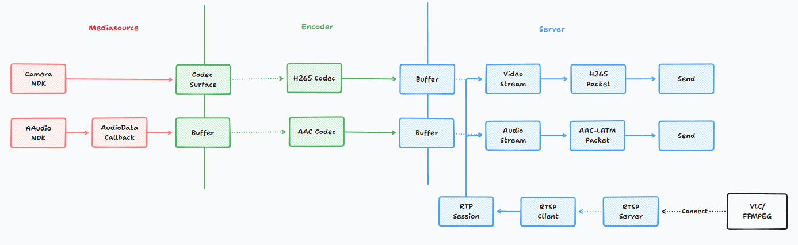
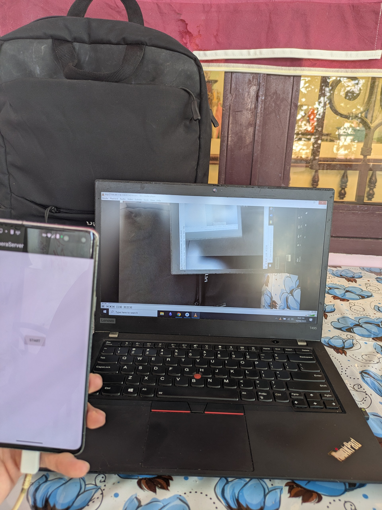

# Android Camera RTSP

This is my journey to bring a new life to my old Samsung S10 5G, which still functions perfectly fine. 
You can read the full blog [here](https://pntt3011.github.io/posts/20250817222918/).

I know there're still works to do, especially the battery part, or my house will end up in fire.
But that's another day story.

## Features
- Record from Camera and Microphone.
- Encode with H265 + AAC.
- Host an RTSP Server + Stream over RTP/TCP (not support UDP due to quality reasons).
- A/V sync using RTCP Sender Report.
- Use foreground service to keep the application alive.
- No busy-waiting in any threads.
- Try my best not to allocate dynamic memory.

## Pipeline

I decide to use the NDK API because Java API has memory leak ([link](https://github.com/android/camera-samples/issues/73)).

## How to build
Hardware: An Android device with API level 28+.

Software: Android Studio with latest NDK (but I think the version doesn't really matter).

### Steps
Simply import the repo as an Android Studio project and run.

### Configs
In `app/src/main/cpp/includes/utils/Configs.h`, the following configs are device-dependent:
- `VIDEO_WIDTH`
- `VIDEO_HEIGHT`
- `VIDEO_DEFAULT_FRAME_RATE`
- `VIDEO_MIN_FRAME_RATE`
- `CAMERA_ID`
- `VIDEO_CODEC_PROFILE`
- `VIDEO_CODEC_LEVEL`

You should use Android APIs (just ask ChatGPT to generate the code) to find which config is hardware-acceleration supported. 

## How to use

Android: Start the app -> Click "Start".

PC or any other devices: Use VLC/ffmpeg -> open stream rtsp://\<Android-ip\>:8554/stream.

### Connections
I highly recommend using [Tailscale](https://tailscale.com/) to create a VPN between your devices. After that, you can use the Tailscale's IP to connect. 

## Result
